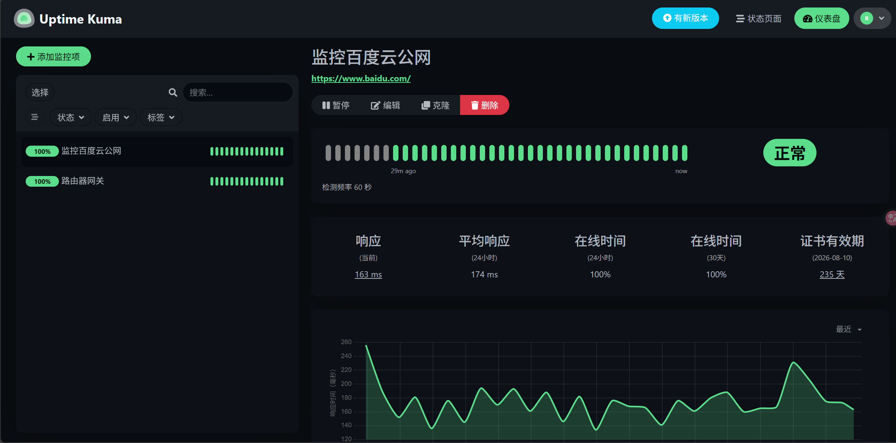
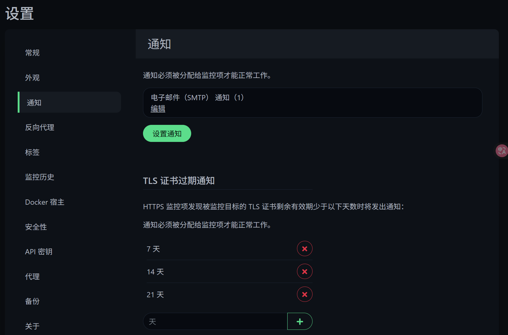

# Uptime Kuma 服务监控平台

**项目简介**：这是一个基于开源工具 Uptime Kuma 搭建的自托管服务监控平台，用于实时监控网站、API 接口及内网服务的可用性与性能，并在服务异常时通过邮件等方式及时发送告警通知。

## ✨ 功能特性

本项目实施的监控平台具备以下核心功能：
*   **多协议监控**：支持 HTTP(s)、TCP 端口、Ping 检测等多种监控类型，全面覆盖常见服务的监控需求。
*   **实时状态面板**：提供直观的 Web 仪表盘，集中展示所有监控项的健康状态、响应时间趋势图和历史数据。
*   **多通道告警**：集成邮件 (SMTP) 等超过 90 种通知方式，确保故障信息能及时送达。
*   **状态页面**：可创建公开的状态页面，方便团队或其他相关人员查看服务状态。
*   **容器化部署**：采用 Docker Compose 部署，保证环境一致性，便于迁移和管理。

## 🚀 快速开始

### 前置要求
*   一台安装有 **Docker** 和 **Docker Compose** 的服务器（如本地 PC、云服务器等）。

### 部署步骤

1.  **获取配置**
    将本项目中的 `docker-compose.yml` 文件放置于服务器上的目标目录，例如 `/opt/uptime-kuma`。


2.  **启动服务**
    在 `docker-compose.yml` 文件所在目录下执行以下命令：

    ```bash
    docker-compose up -d
    ```

3.  **访问平台**
    服务启动后，在浏览器中打开 `http://<你的服务器IP或域名>:3001`。
    *   首次访问需要设置管理员账号和密码。

### 基本配置

1.  **添加监控项**：登录后，点击左上角 "添加监控项"，根据提示填写监控目标（如网址、IP/端口等），并设置监控间隔和告警规则。
2.  **配置通知**：进入 "设置" -> "通知" 页面，添加您的邮件 SMTP 信息或其他通知渠道。完成配置后，务必进行测试。

## 📁 项目文件结构

```
uptime-kuma/
├── docker-compose.yml  # Docker Compose 服务编排文件
└── data/               # 应用数据持久化目录（在首次启动后生成）
    ├── database.sqlite
    └── ...
```

## 🛠️ 日常运维

*   **启动服务**：`docker-compose up -d`
*   **停止服务**：`docker-compose down`
*   **查看日志**：`docker-compose logs -f uptime-kuma`
*   **数据备份**：定期备份项目根目录下的 `data` 文件夹即可。

## 📸 界面预览

_示例：监控概览面板_


_示例：邮件告警通知_


## 🤝 贡献

欢迎提交 Issue 和 Pull Request 来改进此项目文档和部署脚本。

## 📄 许可证

本项目（部署配置与文档）遵循 MIT 许可证。Uptime Kuma 本体遵循 MIT 许可证。

## 🔗 有用链接

*   [Uptime Kuma 官方 GitHub 仓库](https://github.com/louislam/uptime-kuma)
*   [Uptime Kuma 官方在线 Demo](https://demo.kuma.pet/)
